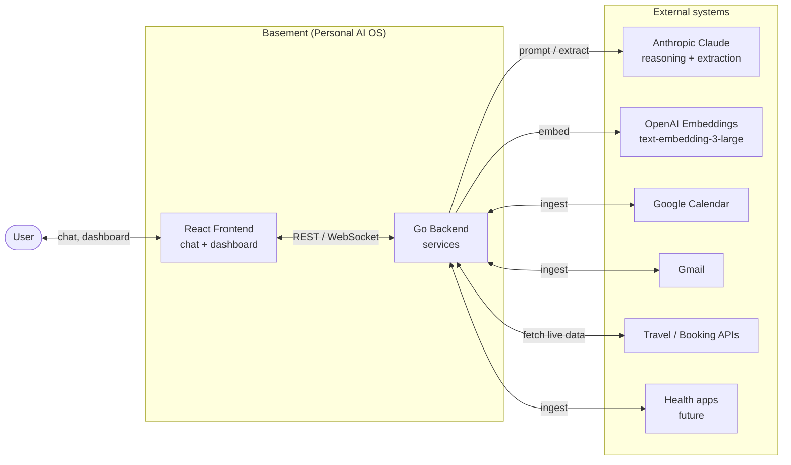
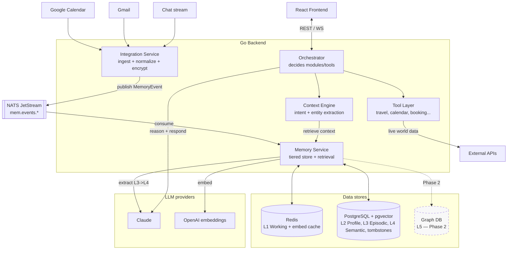
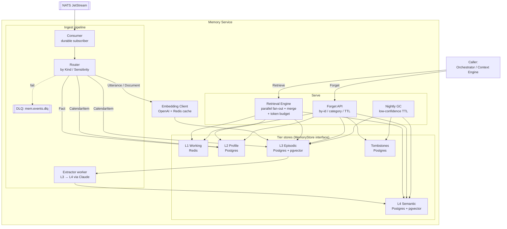
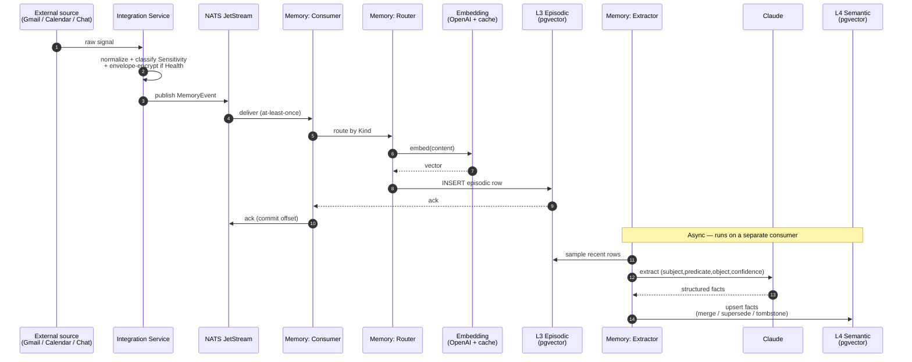
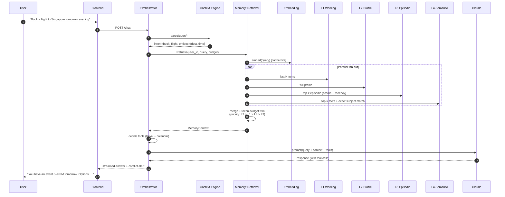
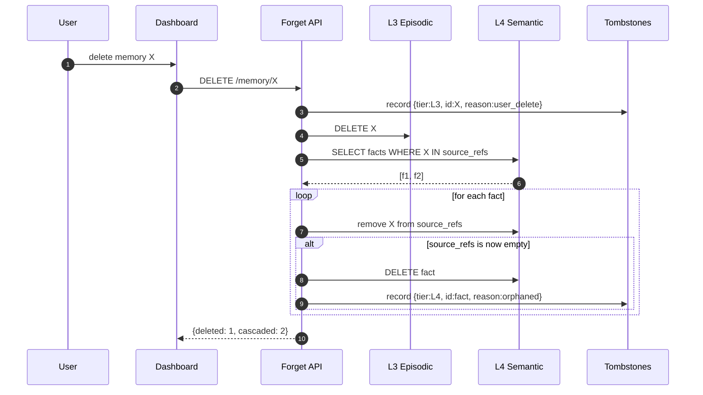
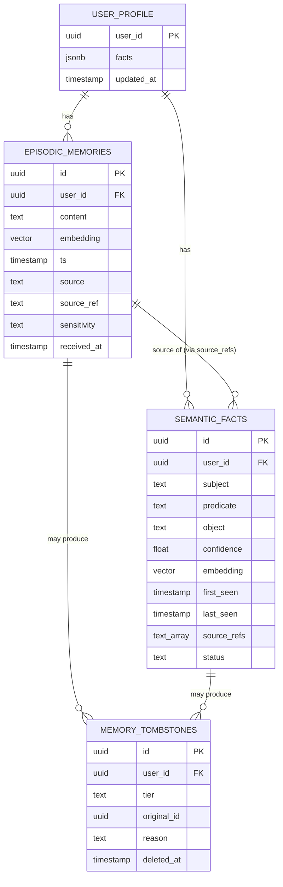

# Basement — High Level Design

Companion to `product.md`. All diagrams are Mermaid — GitHub, VS Code, and most IDEs render them inline.

---

## 1. System context

Who talks to Basement, and which external services Basement talks to.

---

## 2. Component view

All services inside the backend, the event bus, and the data stores.

---

## 3. Memory module — internal design

Zoom into the Memory Service. This is the part we're building first.

---

## 4. Ingestion sequence

From a raw signal at the edge all the way to a queryable semantic fact.

---

## 5. Retrieval sequence

How a user query becomes a contextual answer.

---

## 6. Forget flow

Per-memory delete with cascade to derived semantic facts.

Category purge and TTL decay follow the same tombstone-then-delete pattern; TTL runs on a nightly cron instead of an API call.

---

## 7. Data at rest

---

## Legend

- **Solid arrow** — synchronous call or runtime dependency
- **Dashed arrow** — async / deferred / Phase-2
- **Double-bracket `[[ ]]`** — message bus / queue
- **Cylinder `(( ))`** — data store
- **Dashed border** — Phase 2 component (not in MVP)
